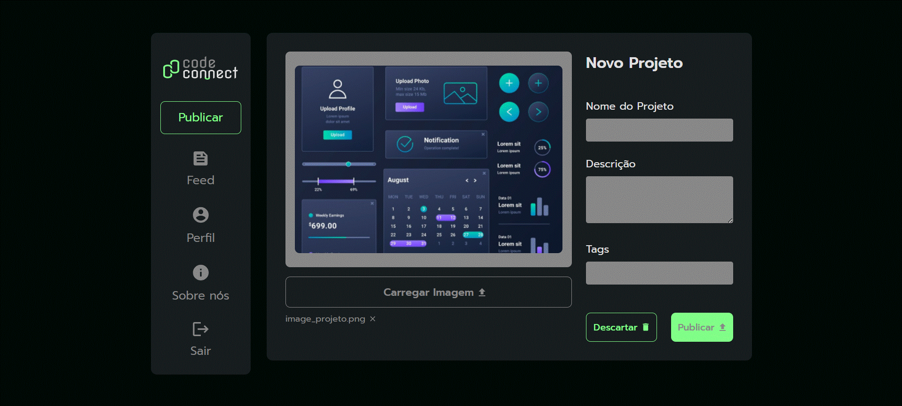

<<<<<<< HEAD
# Code Connect

Aplicação front-end para publicação de projetos, permitindo cadastro de nome, descrição, tags e upload de imagem.

Este projeto foi originalmente desenvolvido durante curso da Alura e posteriormente refatorado com foco em arquitetura, organização de código e boas práticas de desenvolvimento front-end.

## 🔗 Demonstração

A aplicação está disponível em:

https://code-connect-ruddy.vercel.app/

=======
# 💻🔗 Code Connect

Este projeto foi originalmente desenvolvido durante curso da Alura e posteriormente refatorado com foco em arquitetura, organização de código e boas práticas de desenvolvimento front-end.

## 📖 Sobre o projeto

Aplicação front-end para publicação de projetos, permitindo cadastro de nome, descrição, tags e upload de imagem.

---

## 🚀 Funcionalidades

- Criação de novo projeto
- Upload e remoção de imagem
- Adição e remoção dinâmica de tags
- Simulação assíncrona de publicação
- Feedback de sucesso ou erro ao publicar

---
>>>>>>> daab2ee (feat: readme update)

## 📸 Preview

Interface principal da aplicação:

<<<<<<< HEAD
=======
---

## 🚀 Deploy
Acesse o projeto online:

https://code-connect-ruddy.vercel.app/

🚧 Projeto em desenvolvimento. Algumas funcionalidades ainda estão sendo implementadas.

---

## 🛠 Tecnologias

- HTML5
- CSS3
- JavaScript (ES Modules)

---

## 📈 Melhorias Futuras

- Implementar validação mais robusta de formulário
- Melhorar responsividade para dispositivos móveis
- Implementar persistência de dados
- Adicionar feedback visual de loading

---
>>>>>>> daab2ee (feat: readme update)

## 📚 Contexto

Projeto originalmente desenvolvido durante curso da Alura.

Após a conclusão do curso, o código foi completamente refatorado com foco em:

- Modularização com ES Modules
- Separação de responsabilidades
- Estrutura em camadas (DOM, eventos, módulos e serviços)
- Padronização da nomenclatura para inglês (variáveis, funções e parâmetros)
- Melhoria da organização do HTML e CSS
- Simulação de camada de API com Promises

O objetivo da refatoração foi aproximar o projeto de uma estrutura utilizada em aplicações reais.

<<<<<<< HEAD
=======
---
>>>>>>> daab2ee (feat: readme update)

## 🏗 Arquitetura

O código, que inicialmente era monolítico, foi reestruturado utilizando ES Modules e separação de responsabilidades em camadas distintas:

- `dom/` → Centralização de seletores e elementos da interface
- `events/` → Registro e organização dos eventos da aplicação
- `modules/` → Lógica específica de funcionalidades (ex: tags)
- `services/` → Camada de regra de negócio e simulação de API
- `main.js` → Arquivo de inicialização da aplicação

A refatoração teve como objetivo tornar o projeto mais escalável, legível e alinhado com padrões utilizados em aplicações reais.

<<<<<<< HEAD
=======
---
>>>>>>> daab2ee (feat: readme update)

## 🧠 Conceitos Aplicados

Durante a refatoração do projeto, foram aplicados os seguintes conceitos:

- **Modularização com ES Modules**
- **Separação de Responsabilidades (SRP)**
- **Arquitetura em Camadas**
- **Programação Assíncrona com Promises**
- **Manipulação Estruturada de DOM**
- **Organização Escalável de Projeto Front-end**

<<<<<<< HEAD

## 🚀 Funcionalidades

- Criação de novo projeto
- Upload e remoção de imagem
- Adição e remoção dinâmica de tags
- Simulação assíncrona de publicação
- Feedback de sucesso ou erro ao publicar

## 🛠 Tecnologias

- HTML5
- CSS3
- JavaScript (ES Modules)

=======
---
>>>>>>> daab2ee (feat: readme update)

## 📁 Estrutura do Projeto

code-connect/
│
├── img/
│
├── src/
│   ├── controllers/
│   │   └── formController.js
│   │
│   ├── dom/
│   │   └── elements.js
│   │
│   ├── events/
│   │   └── formEvents.js
│   │
│   ├── modules/
│   │   ├── imageUpload.js
│   │   └── tags.js
│   │
│   ├── services/
│   │   ├── publishService.js
│   │   └── tagService.js
│   │
│   └── main.js
│
├── index.html
├── index.js
├── style.css
└── README.md

<<<<<<< HEAD
=======
---
>>>>>>> daab2ee (feat: readme update)

## ▶️ Como Executar

1. Clone o repositório:
<<<<<<< HEAD
   git clone https://github.com/Horvate/code-connect

2. Abra o arquivo `index.html` no navegador.

## 📈 Melhorias Futuras

- Implementar validação mais robusta de formulário
- Melhorar responsividade para dispositivos móveis
- Implementar persistência de dados
- Adicionar feedback visual de loading
- Criar cobertura de testes automatizados

=======
   git clone https://github.com/seu-usuario/seu-repositorio.git

2. Abra o arquivo `index.html` no navegador.

---
>>>>>>> daab2ee (feat: readme update)

## 🔄 Processo de Refatoração

A versão original do projeto (estrutura monolítica) está disponível na branch:

`before-refactor`

Principais melhorias aplicadas:

- Reestruturação do código para arquitetura modular
- Separação clara de responsabilidades
- Padronização da nomenclatura para inglês (variáveis, funções e parâmetros)
- Organização em camadas (controllers, dom, events, modules e services)

<<<<<<< HEAD
## 👨‍💻 Desenvolvido por Eduardo Horvate

=======
---

## 👨‍💻 Autor

Desenvolvido por **Eduardo Sousa Horvate**

## 📫 Contato

- LinkedIn: https://www.linkedin.com/in/eduardo-horvate/?skipRedirect=true
- GitHub: https://github.com/Horvate
>>>>>>> daab2ee (feat: readme update)

